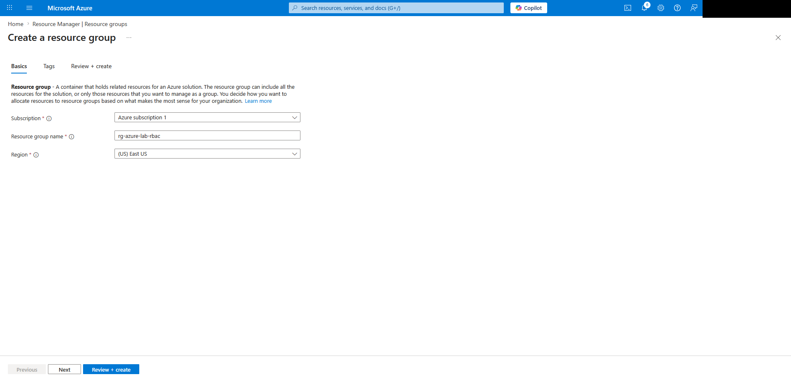
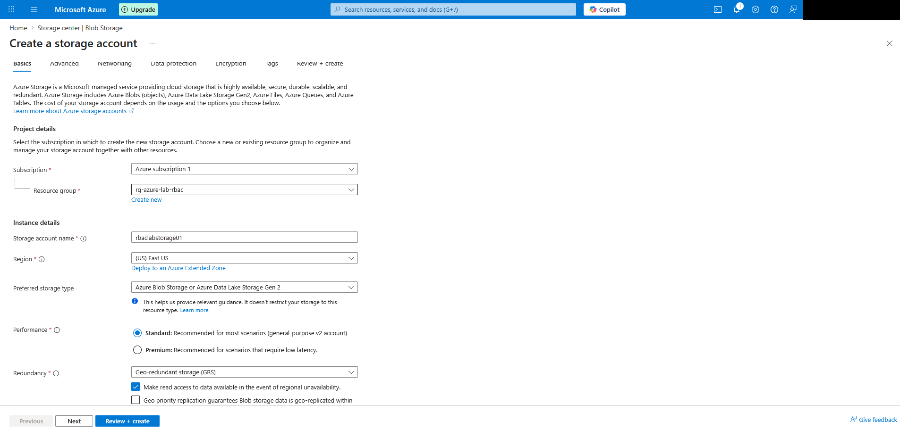
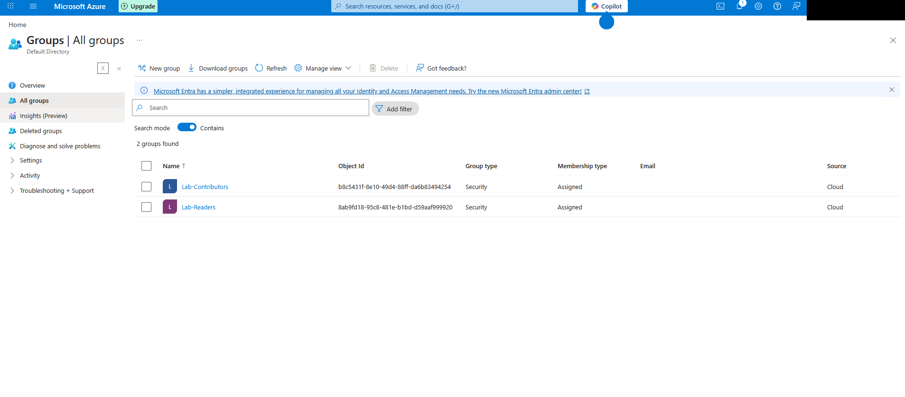
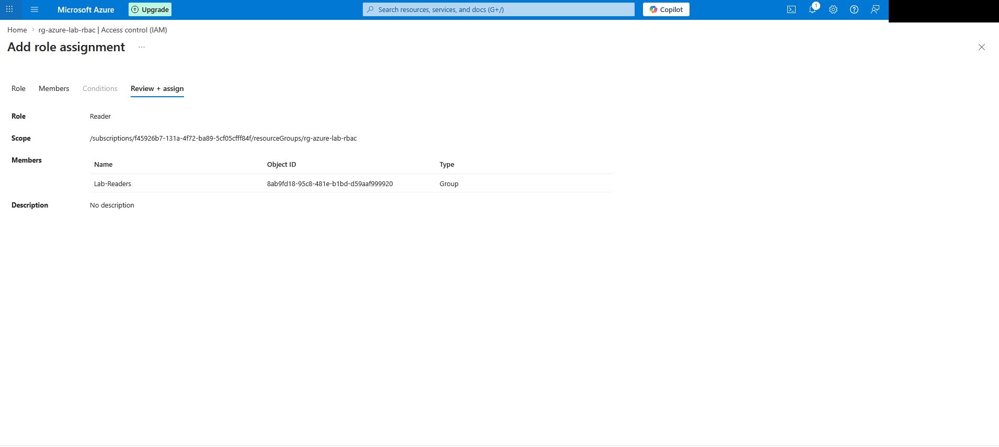
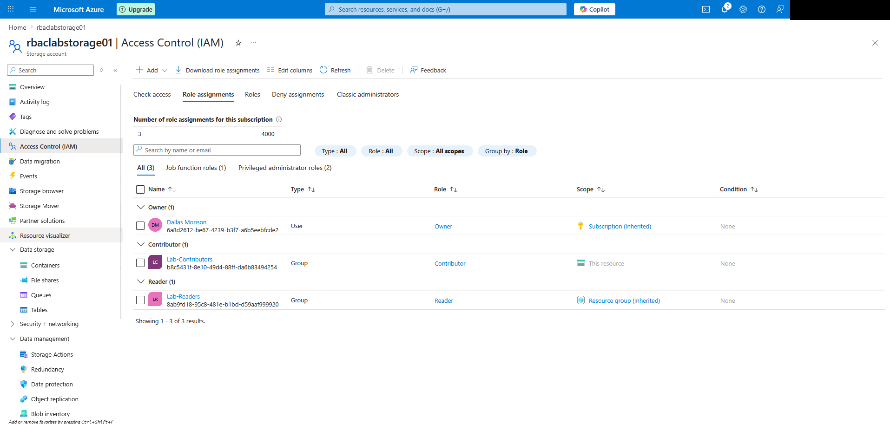

# Azure Lab 3: RBAC at Resource Group and Storage Account Scope

Social preview asset:
- [assets/social-preview.png](assets/social-preview.png)

## Objective

Document a simple Azure role-based access control workflow using Microsoft Entra security groups, a resource group, and a storage account. The goal was to assign different permission levels at different scopes and confirm how inherited access appears in Azure IAM.

## Environment

- Platform: Microsoft Azure
- Subscription shown in evidence: `Azure subscription 1`
- Region shown in build flow: `East US`
- Evidence source: screenshots captured in Azure portal and Microsoft Entra admin center

## Azure Services Used

- Resource Groups
- Azure Storage account
- Microsoft Entra ID groups
- Azure RBAC
- Azure IAM at resource group and resource scope

## Resource Details

- Resource group: `rg-azure-lab-rbac`
- Storage account: `rbaclabstorage01`
- Storage replication shown in the build screenshots: `RA-GRS`
- Entra groups:
  - `Lab-Readers`
  - `Lab-Contributors`

## Lab Relationship

This lab follows the storage and networking foundation work by shifting from resource creation to identity and authorization. It focuses on who can access resources and at what scope, rather than on network reachability or application validation.

## Hiring Manager Quick View

| Review area | Evidence |
|---|---|
| Identity basics | Microsoft Entra groups for `Lab-Readers` and `Lab-Contributors` |
| Least privilege | Reader at resource-group scope and Contributor at storage-account scope |
| Scope awareness | Final IAM view shows direct and inherited assignments separately |
| Documentation quality | Screenshots map each role-assignment step to the final IAM state |
| Security handling | Azure account banner redacted before publication |

## Steps Performed

1. Created the resource group `rg-azure-lab-rbac`.
2. Created the storage account `rbaclabstorage01`.
3. Opened Microsoft Entra and confirmed the tenant initially showed no groups for the lab workflow.
4. Created the `Lab-Readers` security group.
5. Created the `Lab-Contributors` security group.
6. Opened `rg-azure-lab-rbac` and started a new IAM role assignment.
7. Assigned the `Reader` role to `Lab-Readers` at the resource group scope.
8. Opened `rbaclabstorage01` and started a new IAM role assignment.
9. Assigned the `Contributor` role to `Lab-Contributors` at the storage account scope.
10. Reviewed the final storage-account IAM state to confirm inherited and direct permissions appeared as expected.

## Validation

- `Lab-Readers` received a direct `Reader` assignment on `rg-azure-lab-rbac`.
- `Lab-Contributors` received a direct `Contributor` assignment on `rbaclabstorage01`.
- On the storage account IAM page, `Lab-Readers` appeared through inherited access from the resource group.
- The operator account also appeared as `Owner` inherited from the subscription, but that assignment was not created as part of this lab.

## Skills Demonstrated

- Creating and scoping Azure resources
- Creating Microsoft Entra security groups
- Assigning built-in Azure roles
- Distinguishing direct permissions from inherited permissions
- Applying least-privilege access design

## Screenshot Gallery

Key evidence from the lab:

| Step | Screenshot |
|---|---|
| Create the resource group |  |
| Create the storage account |  |
| Confirm Entra groups exist |  |
| Review the Reader role assignment |  |
| Final IAM state on the storage account |  |

## What I Learned

- Azure RBAC becomes easier to reason about when the scope is deliberate.
- Assigning `Reader` at the resource-group level gives broad visibility across resources in that group.
- Assigning `Contributor` directly to a single storage account keeps change permissions narrower.
- The final IAM view makes the inheritance model easier to understand because Azure shows both the direct assignment and the inherited assignment together.

## Problems Encountered / Notes

- The screenshots were copied into this repo from the original lab folder and the Azure account banner was redacted in the repo copies.
- This repo documents only what was visible in the screenshots. It does not assume extra steps that were not shown.
- The storage account uses `RA-GRS` in the captured build flow. That is more than was strictly needed for a low-cost beginner lab, but it is the configuration actually shown in the evidence and is documented as-is.
- An earlier tenant overview showed zero groups before `Lab-Readers` and `Lab-Contributors` were created, which is consistent with the later IAM workflow shown in the evidence.

## Cost Control and Cleanup

- This lab stayed light on cost because it focused on IAM, group creation, and scoped role assignments rather than on compute resources.
- The only billable resource clearly shown is the storage account used as the narrower Contributor target.
- Final resource deletion is not claimed in this public writeup because the current evidence set focuses on RBAC configuration and IAM validation, not cleanup screenshots.

## Outcome

The lab produced a clear Azure RBAC example with group-based role assignment, scope separation between resource group and resource level, and visible IAM inheritance on the final storage account view.
