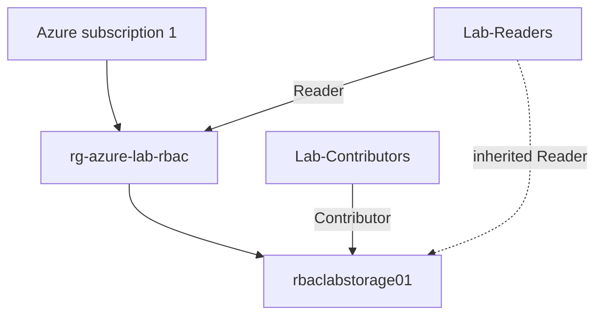

# Scope Diagram

The diagram reflects the final state shown in the screenshots:

- `Lab-Readers` is assigned `Reader` at the resource-group scope
- `Lab-Contributors` is assigned `Contributor` directly on the storage account
- the storage account inherits the `Reader` permission from the parent resource group
